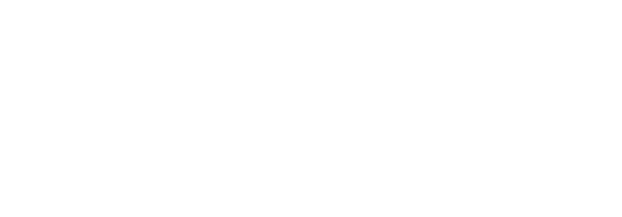

- Szabály-és eszközkészlet
# Nyelvi stílus
- Mondanivalónk megformálásának módja a nyelvi elemek tudatos kiválasztásával és elrendezésével
# Stílusréteg
- A társadalmi érintkezés meghatározott területein
- jellegzetes szövegtípusokhoz és komunikációs célokhoz tatozó
- Sajátos megformálási módok
## Stílusrétegek
- Egyételműségre törekszik
	- Társalgási: Beszélgetek Lehelkével
		- Lehel, hogy vagy?
		- Nagyon jól, köszönöm, ugye egy jó fiú vagyok?
		- Igen, Lehelke, nagyon nagyon.
	- Hivatalos: Érettségi szóbeli
	- Tudományos: Disszertáció védés
	- Szónoki/elődói: Versmondás
	- Publicisztikai: Riportkészítés
	- (Egyházi): Mise
- Többértelműségre törekszik
	- Szépirodalmi: Esszé
# Kommunikáció
- Bármely jelrendszer kölcsönös és szándékos felhasználása az emberi érintkezésben információátadás céljával.
## Tényezői

- Tájékoztató
- Felhívó
- Kifejező
- Kapcsolat(teremtő/tartó/záró)
- Gyönyörködtető
- Értelmező